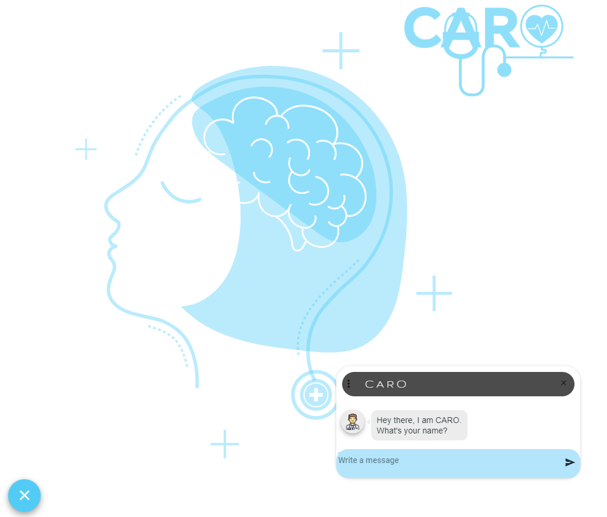
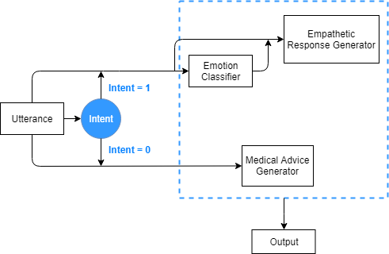

# CARO: An Empathetic Health Conversatinoal chatbot

CARO is an empathetic Health conversatinoal chatbot focussed on peple with major depression. 

<!--  -->

## Usage 
 
<pre><code>python app.py</code></pre>

> Note: We have not released the weights of individual models yet. 

## Approach

## CARO chatbot UI

